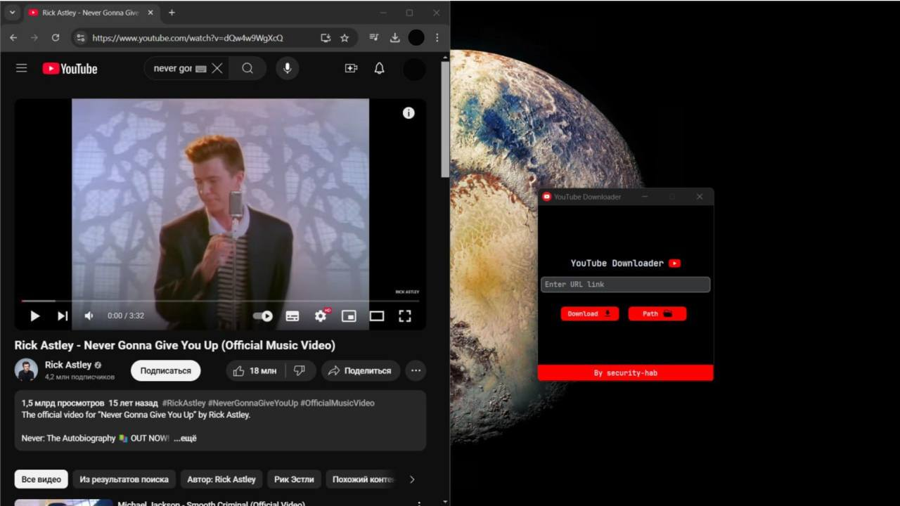

# YouTube Downloader 🎥💻

This is a simple YouTube downloader built using Python and `CustomTkinter`. It allows users to download videos from YouTube by entering the video URL and selecting a directory to save the video. The app features a clean and user-friendly interface, progress bar, and clipboard URL pasting functionality.

## Features ✨

- **Easy to Use**: Enter the YouTube video URL and select a directory.
- **Progress Bar**: Track the download progress with a visual progress bar.
- **Clipboard Support**: Paste the video URL from the clipboard using `Ctrl + V`.
- **Error Handling**: Informative error and success messages.

## Prerequisites 🔧

To run this project, you need to have Python installed and the following dependencies:

- `pytubefix` for downloading YouTube videos.
- `CustomTkinter` for the graphical interface.
- `Pillow` for image handling in the GUI.

Install the required dependencies:

```bash
pip install pytubefix customtkinter pillow
```

## How to Use 🚀

1. Clone this repository:

   ```bash
   git clone https://github.com/security-hab/youtube-downloader.git
   ```

2. Navigate to the project directory:

   ```bash
   cd youtube-downloader
   ```

3. Run the script:

   ```bash
   python app.py
   ```

4. Enter the YouTube video URL in the input field, select a directory to save the video, and click **Download**.

5. Enjoy your video download!

## Screenshots 📸



## Contributing 🤝

Feel free to fork the repository, submit issues, and create pull requests. Contributions are always welcome!

## License 📜

This project is licensed under the MIT License - see the [LICENSE](LICENSE) file for details.
